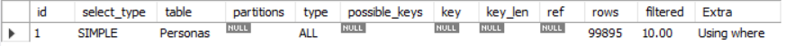
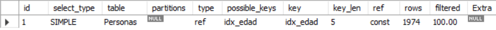
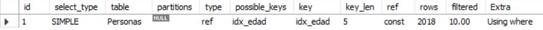
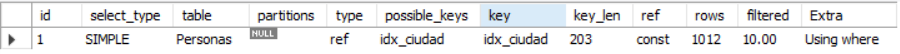
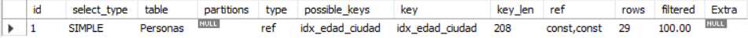

# Trabajo Practico 1

1. Dado un modelo de base de datos de una universidad, identificar violaciones posibles a la integridad referencial si se elimina un estudiante con cursos inscritos. ¿Que mecanismos usarıas para evitarlo?

Si se elimina un estudiante con cursos inscritos, lo que puede ocurrir es que quede el estudiante registrado en cursos pero que el mismo haya dejado de existir, lo cual violaria la integridad de la base de datos. 

Para evitar este problema, se pueden utilizar dos mecanismos:

- **`ON DELETE CASCADE`**: eliminaria todos los registros relacionados con el estudiante eliminado, mantieniendo la integridad.
- **`ON DELETE RESTRICT`**: no permitiria borrar al estudiante si esta inscrito a cursos.
---

2. Crear una tabla *Matriculas* con restricciones de clave foranea. Luego, insertar datos que violen la integridad y mostrar el error generado.

```sql
CREATE TABLE Estudiantes (
    id_estudiante INT PRIMARY KEY,
    nombre VARCHAR(100)
);

CREATE TABLE Matriculas (
    id_matricula INT PRIMARY KEY,
    id_estudiante INT,
    id_curso INT,
    FOREIGN KEY (id_estudiante) REFERENCES Estudiantes(id_estudiante)
);

INSERT INTO Estudiantes (id_estudiante, nombre)
VALUES (1, "Ramiro"), (2, "Ana"), (3, "Facundo"), (4, "Mateo");

INSERT INTO Matriculas (id_matricula, id_estudiante, id_curso)
VALUES (1, 999, 101);  
```

Insertamos en Matriculas un id_estudiantes = 999, que no existe en Estudiantes, y nos da este error:

```
Error Code: 1452. Cannot add or update a child row: a foreign key constraint fails (`uni`.`matriculas`, CONSTRAINT `matriculas_ibfk_1` FOREIGN KEY (`id_estudiante`) REFERENCES `estudiantes` (`id_estudiante`))
```
---

3. Simular una situacion donde dos usuarios intentan actualizar el mismo saldo de una cuenta bancaria. Analizar como afectan las condiciones de aislamiento (READ COMMITTED vs SERIALIZABLE).

```sql
CREATE TABLE Cuentas(
  id_cuenta INT PRIMARY KEY,
    saldo INT
);

INSERT INTO Cuentas (id_cuenta, saldo)
VALUES (1, 2000);
```
---

4. Usar una base de datos con mas de 100,000 registros. Ejecutar una consulta sin ındice y luego con ındice. Usar EXPLAIN para comparar rendimiento.

Primero creamos una tabla Personas:
```sql 
CREATE TABLE Personas (
    id INT AUTO_INCREMENT PRIMARY KEY,
    nombre VARCHAR(50),
    edad INT,
    ciudad VARCHAR(50)
);
```

Despues le agregamos los 100.000 registros (Procedure cortesia de GPT): 
```sql
CREATE PROCEDURE cargar_datos()
BEGIN
    DECLARE i INT DEFAULT 1;
    WHILE i <= 100000 DO
        INSERT INTO Personas (nombre, edad, ciudad)
        VALUES (
            CONCAT('Persona_', i),
            FLOOR(18 + RAND() * 50),
            CONCAT('Ciudad_', FLOOR(1 + RAND() * 100))
        );
        SET i = i + 1;
    END WHILE;
END$$

DELIMITER ;

CALL cargar_datos();
```

Ahora hacemos un explain select sin utilizar un indice.
```sql
EXPLAIN SELECT * FROM Personas WHERE edad = 25;
```

Lo que nos devuelve esta tabla:


La tabla nos dice que se leyeron 99895 rows, y el type = ALL indica que se hizo un Sequential Scan, es decir que se leyeron todas las rows sin usar ningun indice.

Ahora le agregamos un indice en edad y ejecutamos el explain select.

```sql 
CREATE INDEX idx_edad on Personas (edad);

EXPLAIN SELECT * FROM Personas WHERE edad = 25;
```
Y nos devuelve esta tabla:


En esta tabla podemos ver que type = ref, lo que indica que se hizo un Index Scan, es decir que se leyeron rows haciendo uso de un indice. Ademas podemos ver que se leyeron 1974 rows en este select, una cantidad muchisimo menor que en el select sin el indice, es decir mucho mas eficiente.

---

5. Diseñar una consulta que filtre por multiples campos. Crear diferentes ındices y medir cual ofrece mejor rendimiento.







El indice que ofrece mayor rendimiento es el compuesto por edad y ciudad (idx_edad_ciudad) ya que disminuye al minimo la cantidad de rows analizadas, ahorrando tiempo de respuesta y uso de recursos.

---

6. Crear una vista que resuma las ventas mensuales por producto. Luego, usarla en una consulta que devuelva los 5 productos más vendidos.

Primero creamos la tabla de ventas:
```sql
CREATE TABLE Ventas (
  id INT AUTO_INCREMENT PRIMARY KEY,
  id_producto INT,
  cantidad INT,
  fecha DATE
);
```
Luego creamos una vista que agrupe las ventas por mes y producto:
```sql
CREATE VIEW ventas_mensuales AS
SELECT 
  id_producto,
  DATE_FORMAT(fecha, '%Y-%m') AS mes,
  SUM(cantidad) AS total_vendido
FROM Ventas
GROUP BY id_producto, mes;
```
Consulta para obtener los 5 productos mas vendidos de todos los meses:
```sql
SELECT 
  id_producto,
  SUM(total_vendido) AS ventas_totales
FROM ventas_mensuales
GROUP BY id_producto
ORDER BY ventas_totales DESC
LIMIT 5;
```

7. Crear un usuario analista que solo pueda hacer SELECT en ciertas tablas. Intentar insertar datos desde ese usuario y explicar el resultado obtenido.

Creamos el usuario analista:
```sql
CREATE USER 'analista'@'localhost' IDENTIFIED BY 'analista123';
--Otorgamos permisos solo de lectura en la bdd
GRANT SELECT ON universidad.* TO 'analista'@'localhost';
--Aplicamos cambios
FLUSH PRIVILEGES;
```
Ahora conectados como el usuario analista, intentamos insertar un registro:

```sql
INSERT INTO Estudiantes (nombre) VALUES ('Juan');
```

Lo cual devuelve este error en MySql:

```
ERROR 1142 (42000): INSERT command denied to user 'analista'@'localhost' for table 'Estudiantes'
```
---

8. Simular una auditoría simple utilizando triggers que registren toda modificación en la tabla Clientes.

Creamos la tabla de auditorias:

```sql
CREATE TABLE auditoria_clientes (
  id INT AUTO_INCREMENT PRIMARY KEY,
  cliente_id INT,
  accion VARCHAR(10),
  fecha TIMESTAMP DEFAULT CURRENT_TIMESTAMP
);
```
Creamos trigger para registrar actualizaciones:
```sql
DELIMITER //

CREATE TRIGGER after_update_cliente
AFTER UPDATE ON Clientes
FOR EACH ROW
BEGIN
  INSERT INTO auditoria_clientes (cliente_id, accion)
  VALUES (OLD.id, 'UPDATE');
END //

DELIMITER ;
```
---

9. Documentar paso a paso cómo realizar un backup completo en MySQL o PostgreSQL. Luego, simular una pérdida de datos y su posterior recuperación usando el backup.

Tenemos una base de datos llamada universidad, y el archivo donde se guarda el backup queremos que se llame universidad_backup.sql, entonces nuestro backup lo tenemos que hacer así desde la terminal:

```
mysqldump -u root -p universidad > universidad_backup.sql
```

Simulamos una perdida de datos:
```sql
DROP DATABASE universidad;
```
Y otra vez, desde la terminal, debemos hacer la restauracion del backup con estos comandos:

```
mysql -u root -p -e "CREATE DATABASE universidad;"
mysql -u root -p universidad < universidad_backup.sql
```